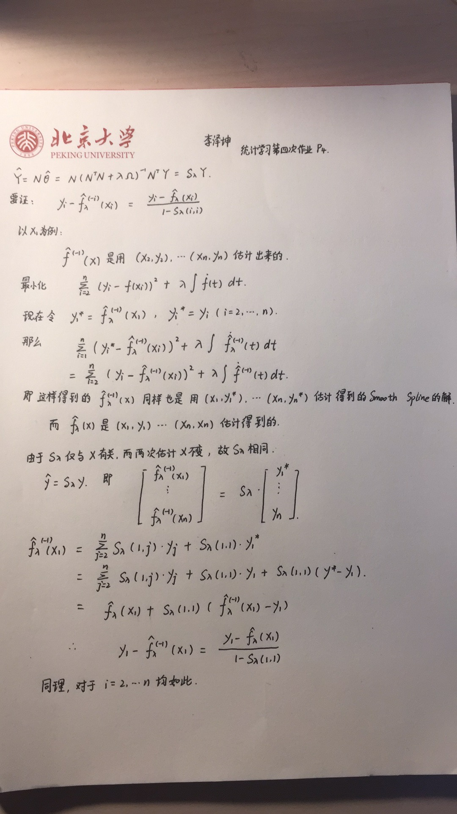

```{r setup, include=FALSE}
knitr::opts_chunk$set(echo = TRUE)
```
# Problem 1

$X\sim{U[0,1]},Y\sim{N(0,1)}$,we use different models to fit this data to get the result that splines has larger **Pointwise Variance** at knots.

## Data Preparation
```{r eval=FALSE}
library(ggplot2)
library(splines)

n=50
set.seed(200)
x = runif(n,min=0,max=1)
x = sort(x)
y = rnorm(n,0,1)
one =seq(1,1,length.out=n)
```
```{r include=FALSE}
library(ggplot2)
library(splines)

n=50
set.seed(200)
x = runif(n,min=0,max=1)
x = sort(x)
y = rnorm(n,0,1)
one =seq(1,1,length.out=n)
```
## Building Model

I use following function to calculate **Pointwise Variance** according to formula in the book.

$\hat\beta$ is **Pointwise Variance**.

```{r}
ptv<-function(model,X){
  p = length(model$coefficients)
  res = sum((model$residuals)^2)/(n-p)
  X = cbind(one,X)
  inv = solve(t(X)%*%X)
  var = 0
  V = X%*%(inv*res)%*%t(X)
  return (diag(V))
}
```

### Global Linear

There are 2 parameters in this model.

```{r}
model1 = lm(y~x)
Var1 = ptv(model1,x)
```

### Global Cubic Polynomial

There are 4 parameters in this model.

```{r}
X2 = cbind(x,x^2,x^3)
model2 = lm(y~X2)
Var2 = ptv(model2,X2)
```

### Cubic Splines - 2 knots

knots = (0.33,0.66) according to book.
There are 6 parameters in this model.

```{r}
cubic_spline = bs(x,degree=3,knots=c(1/3,2/3))
model3 = lm(y~cubic_spline)
Var3 = ptv(model3,cubic_spline)
```

### Natural Cubic Splines - 6 knots

knots = (0.1,0.26,0.42,0.58,0.74,0.9) according to book.
There are 6 parameters in this model.

```{r}
natural_spline = ns(x,df=6,knots=seq(0.1,0.9,length.out=6)[2:5],Boundary.knots = c(0.1,0.9))
model4 = lm(y~natural_spline)
Var4 = ptv(model4,natural_spline)
```

## Draw Plots

```{r}
result = data.frame(x,Var1,Var2,Var3,Var4)
p = ggplot(data=result)
p+geom_point(aes(x=x,y=Var4,color="Natural Cubic Spline - 6 knots"),size=2)+
geom_line(aes(x=x,y=Var4,color="Natural Cubic Spline - 6 knots"),size=1)+
 geom_point(aes(x=x,y=Var3,color="Cubic Spline - 2knots"),size=2)+
  geom_line(aes(x=x,y=Var3,color="Cubic Spline - 2knots"),size=1)+
 geom_point(aes(x=x,y=Var2,color="Global Cubic Polynomial"),size=2)+
  geom_line(aes(x=x,y=Var2,color="Global Cubic Polynomial"),size=1)+
 geom_point(aes(x=x,y=Var1,color="Global Linear"),size=2)+
  geom_line(aes(x=x,y=Var1,color="Global Linear"),size=1)+
 scale_y_continuous("Pointwise Variance")+scale_x_continuous("X")+
  guides(color=guide_legend(title=NULL))+theme(legend.position = 'top')+
  scale_color_discrete(breaks = c('Global Linear','Global Cubic Polynomial',
                'Cubic Spline - 2knots','Natural Cubic Spline - 6 knots'))+
  theme(panel.grid.major =element_blank(), panel.grid.minor = element_blank(),
        panel.background = element_blank(),axis.line = element_line(colour = "black"))
```

From the plots, we find the same phenomenon in the book.

# Problem 2

## Data Preparation
First, we generate data.
$X\sim{U[0,1]}$,$\epsilon\sim{N(0,1)}$
\[Y=\frac{sin(12(X+0.2))}{X+0.2}+\epsilon\]

```{r,eval=FALSE}
n=100
X = runif(n,0,1)
X = sort(X)
eps = rnorm(n,0,1)
f = function(x){sin(12*(x+0.2))/(x+0.2)}
Y = f(X)+eps
```

```{r,include=FALSE}
n=100
X = read.csv("realX.txt")
X = as.matrix(X)
eps = read.csv("realeps.txt")
eps = as.matrix(eps)
f = function(x){sin(12*(x+0.2))/(x+0.2)}
Y = f(X)+eps
```

## Cross Validation & EPE
For different $\lambda$, we calculate CV and EPE, then choose the best $df_{\lambda}$. In addition, we find EPE and CV curves have a similar shape, but the entire CV curve is above the EPE curve.

Before that, we need some auxiliary functions.
Following calculate pointwise variance.
\[Cov(\hat{f})=S_{\lambda}Cov(y)S_{\lambda}^{T})\]

```{r}
#calculate pointwise
cal_ptv = function(df){
  eye = diag(rep(1,n))
  S_lambda = matrix(0,n,n)
  for (i in 1:n){
    # calculation of $S_lambda$
    tempss = smooth.spline(X,eye[,i],df=df)
    S_lambda[,i] = predict(tempss,X)$y
  }
  return (diag(S_lambda%*%t(S_lambda)))
}

```

In next section, I calculate EPE and CV for $df_{lambda}$ range from 5 to 15, 25 values in total.

```{r}
m = 25
dff = seq(5,15,length.out = m)
EPE=CV=0
for(i in 1:m){
  epe=cv=0
  ss = smooth.spline(X,Y,df =dff[i],cv=TRUE)
  for(j in 1:n){
    epe[j] = (predict(ss,X)$y[j]-f(X[j]))^2
    # (5.26)
    cv[j] = (ss$y[j]-Y[j])^2/
            (1-ss$lev[j])^2
  }
  # (5.25)  sigma_square + MSE
  EPE[i] = sum(epe)/n+1+mean(cal_ptv(dff[i]))
  CV[i] = sum(cv)/n
}
```

```{r,include=FALSE}
par(mfrow=c(2,2))
# plot 1
plot(dff,EPE,type='p',col="darkorange2",
     ylim=c(1.0,1.6),pch=20,ylab="EPE  and  CV",
     main= "Cross Validation")
points(dff,CV,type='p',col="deepskyblue2",pch=20)
abline(v=which.min(CV))
legend("topright",c("CV","EPE"),
       col=c("darkorange2","deepskyblue2"),
       lty='solid',lwd=3)
```

Then, I use following function to draw another 3 plots together.

```{r}
# function to plot 2,3,4
draw<-function(df){
  sd2 = 2*sqrt(cal_ptv(df))
  # fit (x,y)
  ss = smooth.spline(X,Y,df=df)
  plot(X,Y,type='p')
  title(main=paste("df=",df))
  polygon(c(X,rev(X)),
          c(ss$y+sd2,rev(ss$y-sd2)),
          col="lightgoldenrod1",border=NA)
  points(X,Y,lwd=1.5)
  curve(f,col="darkorchid",add=TRUE,lwd=3.5)
  lines(ss,col="forestgreen",lwd=3.5)
}


# plot 2 3 4
df = c(5,9,15)
for (i in df)
  draw(i)
```

From 4 plots above, we almost get the same results as that in the book.

# Problem 3

## Data Preparation

Input data and library. This data is randomly arranged itself, so we can just divide 10 folds by order.

```{r}
library(MASS)
data = read.csv("data.txt")
n = 4500
X = as.matrix(data[1:n,2:257])
Y = data[1:n,258]
fold=matrix(0,nrow=450,ncol=10)
for(i in 1:10)
fold[,i] = ((i-1)*450+1):(i*450)
```

## Natural Cubic Spline Transformation
we view $X$ as a function of $f$, we perform following transformation.
\[x_j=\sum_{i=1}^{k}N_i(f)\theta_{ji}\]

then use QDA on $\hat\theta_j$.Choose 8,248 as boundary knots.
I write the following function to achieve that.

```{r}
ss = function(x,df){
  f=1:256
  basis = ns(f,
             knots=seq(8,248,length.out = df+1)[2:df],
             Boundary.knots = c(8,248)
             )
  H = matrix(0,nrow=n,ncol=df+1)
  for(i in 1:n){
    mo = lm(x[i,]~basis)
    H[i,] = mo$coefficients
  }
  return(H)
}
```

## QDA

Then we choose 5 different df value and perform 10-fold cross validation.k=8,16,24,32,40.

```{r}
dfarray=c(8,16,24,32,40)
cv=vector()

for(df in dfarray){
  H = ss(X,df)
  count=0
  for(i in 1:10){
  s = fold[,i]
  model = qda(H[-s,],Y[-s])
  for(j in s){
      if(predict(model,H[j,])$class==Y[j]){
      count=count+1
      }
    }
  }
  cv = c(cv,count/n)
}
cv
```

Finally, we find the best df value. 40 is best.

# Problem 4

